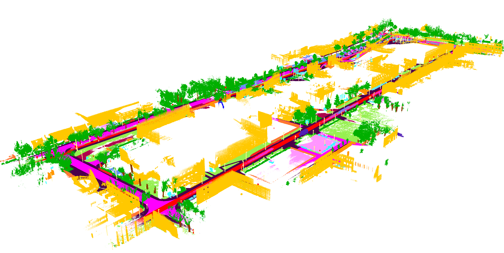
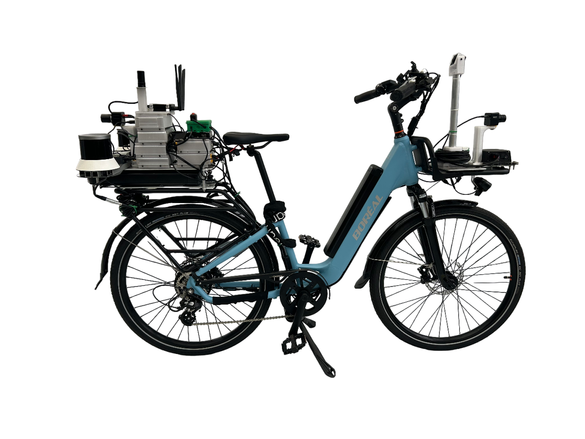
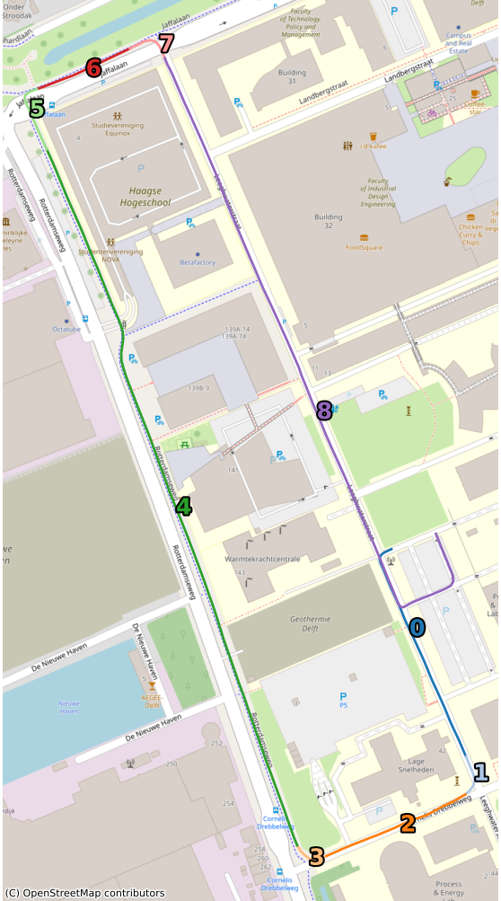
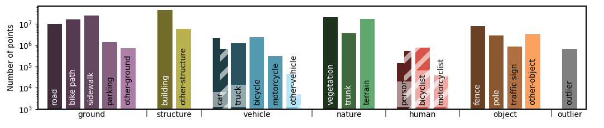

#  BikeScenes-lidarseg dataset

## Overview

The BikeScenes-lidarseg dataset provides semantically annotated 3D LiDAR data from a bicycle's perspective, collected around the TU Delft campus. It is created to facilitate research into cyclist-centric perception. For detailed information on data collection, processing, and baseline model performance, please refer to our accompanying paper:

* **[link to paper]**

Authors: Denniz Goren, Holger Caesar. 

## The SenseBike

<table>
  <tr>
    <td>
      

        This dataset was recorded using the SenseBike, which is based on the Holoscene X by <a href="https://www.borealbikes.com">Boreal Bikes</a>, with additions and modifications by members and students of the Intelligent Vehicles group of the TU Delft.
      

      

        Key sensors on the SenseBike relevant to this dataset include a front-mounted RoboSense M1 Plus LiDAR, a SparkFun ICM-20948 IMU, an ArduSimple simpleRTK2B GPS, and an ArduCam IMX477 camera. Further details about the sensor setup and calibration can be found in our paper.
      

    </td>
    <td align="right" valign="top">
      
    </td>
  </tr>
</table>

## Dataset Contents & File Structure
<table>
  <tr>
    <td>
      

        The BikeScenes-lidarseg dataset is provided in two main directories: <code>entire_sequence</code> and <code>subsequences</code>.
      

      

        The <code>entire_sequence</code> directory contains the full, uninterrupted recording, along with associated images and poses for each scan. In <code>subsequences</code>, we provide the same core data, but split into sequential segments (e.g., <code>00</code>, <code>01</code>, etc.) to reproduce the training and evaluation splits described in our paper. The folder structure is as follows:
      

      <pre><code>bikescenes_lidarseg/
├── entire_sequence/
│   ├── robosense_m1p/
│   │   ├── 1739357499107089281.bin
│   │   └── ...
│   ├── labels/
│   │   ├── 1739357499107089281.label
│   │   └── ...
│   ├── images/
│   │   ├── 1739357499107089281.png
│   │   └── ...
│   ├── calib.txt
│   └── poses.txt
│
├── subsequences/
│   ├── 00/
│   │   ├── robosense_m1p/
│   │   │   └── 000000.bin
│   │   └── labels/
│   │       └── 000000.label
│   ├── 01/
│   │   └── ...
│   ├── ...
│   └── 08/
│       └── ...
</code></pre>
    </td>
    <td align="right" valign="top">
      
      
Locations of subsequences

    </td>
  </tr>
</table>

## Labeling Scheme

We utilize the 28 semantic classes from the SemanticKITTI dataset, with the addition of a distinct `bike-path` class. The labeling was performed manually using the SemanticKITTI labeling tool. 

## Acknowledgements
We gratefully acknowledge the following projects and contributors, whose work and support were instrumental in the development of our dataset and paper:

- [SemanticKITTI](http://www.semantic-kitti.org/)
- [SemanticKITTI API](https://github.com/PRBonn/semantic-kitti-api)
- [Point Labeler](https://github.com/jbehley/point_labeler)
- [FRNet](https://github.com/Xiangxu-0103/FRNet)
- [GLIM](https://github.com/koide3/GLIM) 
- [Boreal Bikes](https://www.borealbikes.com)